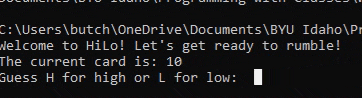

## Overview

HiLo is a game in which the player guesses if the next card drawn by the dealer will be higher or lower than the previous one. Points are won or lost based on whether or not the player guessed correctly.

Instructor: Bro. Parrish

Class: CSE 210

Team: Methuselah

Assignment: Week 04 Hi Lo game

## Description

Hilo is played according to the following rules.

The player starts the game with 300 points.
Individual cards are represented as a number from 1 to 13.
The current card is displayed.
The player guesses if the next one will be higher or lower.
The the next card is displayed.
The player earns 100 points if they guessed correctly.
The player loses 75 points if they guessed incorrectly.
If a player reaches 0 points the game is over.
If a player has more than 0 points they decide if they want to keep playing.
If a player decides not to play again the game is over.

## Executing program
python3 HiLo.py

## Requirements

[X] The program must include a README file.

[X] The program must include class and method comments.

[X] The program must have at least two classes.

[X] The program must remain true to game play described in the overview.

## Authors
Brennon Jacobson - bjjacobson@byui.edu; Emma Hungrige - butcherem@byui.edu; Mark Hammer - ham21019@byui.edu;
Michael Coleman - mjaycole@byui.edu; Joel Jensen - jen21092@byui.edu

## Version History

- 0.0

  - Planning Setup

- 1.0

  - Initial file merge
  - Testing & debugging

- 2.0
  - Final Submission
