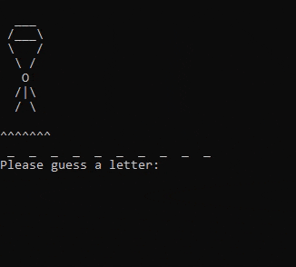

## Overview

Jumper is a game in which the player seeks to solve a puzzle by guessing the letters of a secret word one at a time.
This is similar to Hangman.

## Description

Jumper is played according to the following rules:

1. The puzzle is a secret word randomly chosen from a list.
2. The player guesses a letter in the puzzle.
3. If the guess is correct, the letter is revealed.
4. If the guess is incorrect, a line is cut on the player's parachute.
5. If the puzzle is solved the game is over.
6. If the player has no more parachute the game is over.

## Executing program
python3 Jumper.py

Test words class:
python3 test_words.py

## Requirements

[X] The program must include a README file.

[X] The program must include class and method comments.

[X] The program must have at least four classes.

[X] The program must remain true to game play described in the overview.

## Authors
Brennon Jacobson - bjjacobson@byui.edu; Emma Hungrige - butcherem@byui.edu; Mark Hammer - ham21019@byui.edu;
Michael Coleman - mjaycole@byui.edu; Joel Jensen - jen21092@byui.edu

## Version History

- 0.0
  - Planning Setup

- 1.0
  - Testing & Bug Fixes

- 2.0
  - Final Submission Phase
