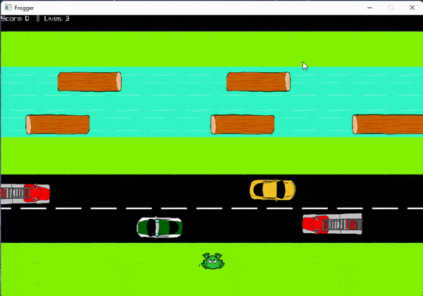

# Python Projects
This repository contains all large Python projects I have worked on and successfully completed. A description of each project is found below:

## [Frogger](https://github.com/Ithielwen/Python-Projects/tree/main/Frogger)

Task: Recreate the Frogger game using Python code and Pyray

Challenge: Use classes, methods, and multiple files

Outcome: Frogger game created

Result: Successfully completed

## [Cycle](https://github.com/Ithielwen/Python-Projects/tree/main/Cycle)
Task: Create a Snake game using Python code and Pyray

Challenge: Use classes, methods, and multiple files

Outcome: Cycle game created

Result: Successfully completed

## [Greed](https://github.com/Ithielwen/Python-Projects/tree/main/Greed)
Task: Create a Greed game using Python code and Pyray

Challenge: Use classes, methods, and multiple files

Outcome: Greed game created

Result: Successfully completed

## [Jumper](https://github.com/Ithielwen/Python-Projects/tree/main/Jumper)
Task: Create a Hangman game using Python code

Challenge: Use classes, methods, and multiple files

Outcome: Jumper game created

Result: Successfully completed

## [Jumper](https://github.com/Ithielwen/Python-Projects/tree/main/Jumper)
Task: Create a Hangman game using Python code

Challenge: Use classes, methods, and multiple files

Outcome: Jumper game created

Result: Successfully completed

## [Adventure](https://github.com/Ithielwen/Python-Projects/tree/main/Choose%20Your%20Own%20Adventure)
Task: Create a choice tree within Python

Challenge: Only use functions & one choice tree must have three choices

Outcome: D&D themed "Choose Your Own Adventure"

Result: Successfully completed

## [Adventure-test](https://github.com/Ithielwen/Python-Projects/tree/main/Choose%20Your%20Own%20Adventure)
Task: Create test functions for all testable functions in the prior file

Challenge: All functions must be testable

Outcome: Test functions created for all functions in Adventure.py

Result: Successfully completed

## [Tic Tac Toe](https://github.com/Ithielwen/Python-Projects/tree/main/Tic%20Tac%20Toe)
Task: Create Tic Tac Toe game using Python code

Challenge: Use functions

Outcome: Tic Tac Toe game created

Result: Successfully completed

## [HiLo](https://github.com/Ithielwen/Python-Projects/tree/main/Hi%20Lo)
Task: Create a HiLo card game using Python code

Challenge: Use classes, methods, and multiple files

Outcome: HiLo cardgame created

Result: Successfully completed
